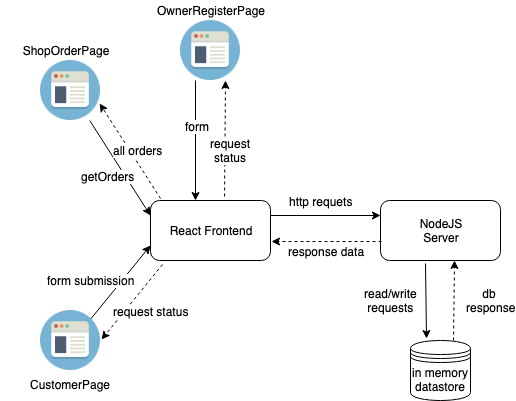

# CoffeeShop

## System Deisgn Overview
### Data Flow Graph


### Entity Relation Diagram


## BackEnd Server
1. Currently, only the backend logic is implemented
2. There are four entrypoints can be call, all are POST reuqests:
    - `/register` - used by Baristas to register their coffee shops
    - `/getOrders` - used by Baristas to check all available orders for their shops
    - `/createOrder` - used by customers to create orders to shops
    - `/delteOrder` - can be used by both Baristas and customers to complete orders

### To run Server locally
1. run `npm install` to install required packages
2. run `npm start` to start server
3. server now can be reached at `localhost:3000`

### To build the docker image and run it on docker
1. run `./build.sh` to build and run the docker iamges
3. server now can be reached at `localhost:49160`

## Data Contract
**Note that all requests bodies should be in valid JSON format**

---

### `/register`
Required fields : "shopName","address","phone"

Sample Input:
```
{
    "shopName": "testShopName",
    "address": "123 ave",
    "phone": "123-456-7890"
}
```
Sample Output:
```
register request completed successfully, please keep the following data secret:
{"shopId":"771239b5-60b5-4903-992f-c49a0470ac1c","apiToken":"b36b1382f65cede15c8b2eb485cc92d7"}
```

---

### `/getOrders`
Required fields : "shopId","apiToken"

Sample Input:
```
{
    "shopId":"771239b5-60b5-4903-992f-c49a0470ac1c","apiToken":"b36b1382f65cede15c8b2eb485cc92d7"
}
```
Sample Output:
```
[
    {
        "order_id": "3b401b98-aaf7-428c-a790-85f6171b567f",
        "shop_name": "testShop",
        "order_detail": "2 order of fried chicken",
        "customer_phone": "7781231234",
        "pickup_time": "2019-08-27 21:54:00",
        "status": "created"
    },
    {
        "order_id": "fda9c02a-cec6-4450-9194-0f7535387eb7",
        "shop_name": "testShop",
        "order_detail": "2 order of fried chicken",
        "customer_phone": "7781231234",
        "pickup_time": "2019-08-27 21:54:00",
        "status": "created"
    }
]
```

---

### `/createOrder`
Required fields : "shopName","orderDetail","customerName","customerPhone","pickupTime"

Sample Input:
```
{
	"shopName": "testShop",
	"orderDetail":"2 order of fried chicken",
	"customerName": "name",
	"customerPhone": "7781231234",
	"pickupTime": "2019-08-27 21:54:00"
}
```
Sample Output:
```
order has been sent to coffee shop, orderId is: f4588a4a-85c9-44c6-89be-813a7650b653
```

---

### `/deleteOrder`
Required fields : "orderId"
Optional fields : "apiToken" (only shop owners has apiTokens)

Sample Input:
```
{
    "orderId":"f4588a4a-85c9-44c6-89be-813a7650b653"
}
```
Sample Output:
```
order is successfully closed
```